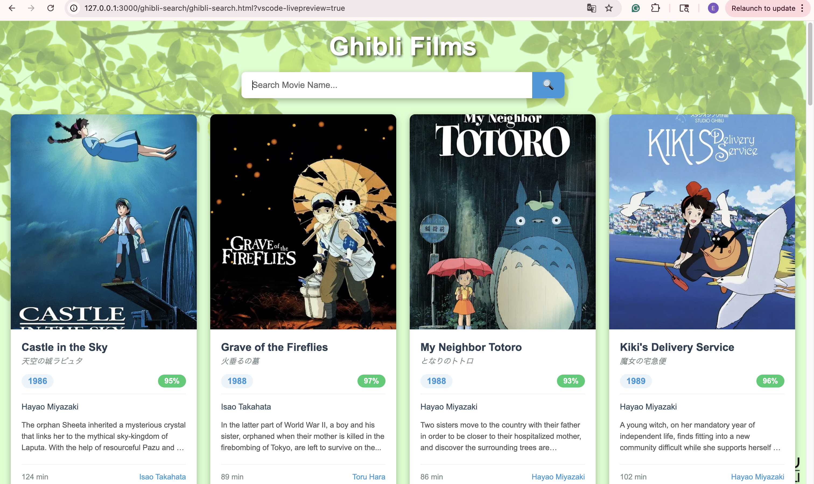
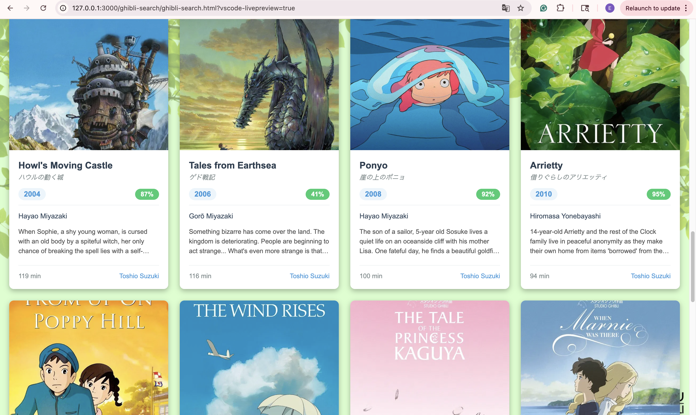
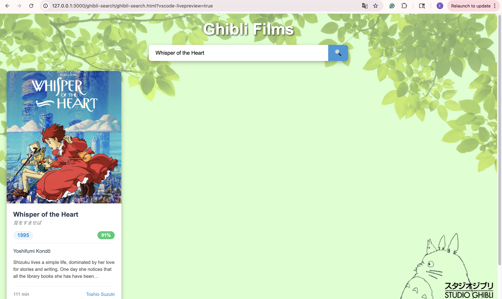
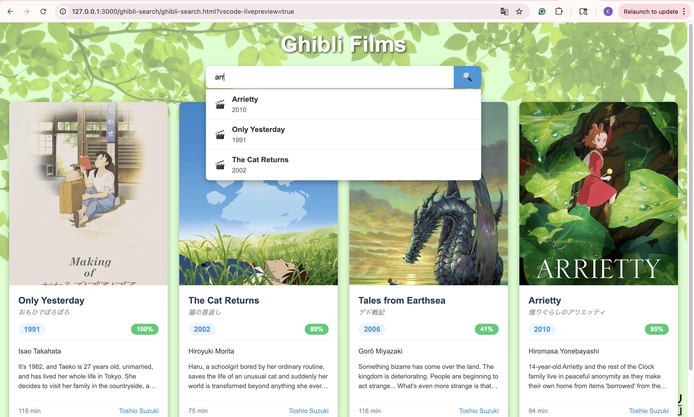

# GhibliVerse 🌿
By [Elnara Kanybek](https://github.com/ElnaraKanybek)
### A responsive Studio Ghibli film search app
 
Go to demo: [Webpage Demo](https://github.com/ElnaraKanybek/ghibli-films-search#%EF%B8%8Fwebpage-demonstration) (click here)
 
## Overview
 
* [Core Functionality](https://github.com/ElnaraKanybek/ghibli-films-search#core-functionality)
* [Tech Stack](https://github.com/ElnaraKanybek/ghibli-films-search#%EF%B8%8Ftech-stack)
* [Project Structure](https://github.com/ElnaraKanybek/ghibli-films-search#project-structure)
* [Getting Started](https://github.com/ElnaraKanybek/ghibli-films-search#getting-started)
* [Webpage Demo](https://github.com/ElnaraKanybek/ghibli-films-search#%EF%B8%8Fwebpage-demonstration)
* [Credits](https://github.com/ElnaraKanybek/ghibli-films-search#credits)
## Core Functionality
 
* 🔍 **Live search** — debounced input search across film titles, original titles, and descriptions
* 💡 **Autocomplete suggestions** — dropdown of matching titles as you type
* 🎬 **Film cards** — poster, release year, Rotten Tomatoes score, director, producer, runtime, and description
* 🖼️ **Graceful image fallback** — displays a placeholder icon if a poster fails to load
* 📱 **Responsive layout** — adapts from desktop grid down to a single-column mobile view
## 🛠️Tech Stack
 
* HTML5 / CSS3
* Vanilla JavaScript (ES modules)
* [jQuery 3.7.1](https://jquery.com/) for DOM manipulation and event delegation
* [Studio Ghibli API](https://ghibliapi.vercel.app) for film data
## Project Structure
 
```
ghibli-search/
├── ghibli-search.html      # Page markup
├── ghibli-search.css       # Styles
└── ghibli-search.js        # App logic (GhibliSearchApp controller)
services/
└── ghibli-api.js           # Fetches films, builds search suggestions
utils/
└── film-formatters.js      # Builds film card and suggestion HTML
images/
├── moviepage.png
├── scrolling.png
├── search.png
└── searching.png
```
 
## Getting Started
 
1. Clone the repo:
```bash
   git clone https://github.com/ElnaraKanybek/ghibli-films-search.git
   cd ghibli-films-search
```
2. Open `ghibli-search/ghibli-search.html` in a browser, or serve the project with a local static server (recommended, since it uses ES modules):
```bash
   npx serve .
```
3. Navigate to the Ghibli Films page and start searching.
No build step or dependencies to install — jQuery is loaded via CDN.
 
## ✨Webpage Demonstration
 
**Main Page:**
 

 
The main view displayed when a user first visits the page. All Studio Ghibli films are loaded and shown as cards, each with a poster, release year, score, director, and description.
 
**Scrolling:**
 

 
Users can scroll through the full grid of film cards, which reflows responsively based on screen size.
 
**Search:**
 

 
A user has typed a movie title into the search bar, and the film matching that title is displayed.
 
**Live Suggestions:**
 

 
As the user types, a dropdown of live search suggestions appears, letting them pick a film without finishing the full title.
 
## Credits
 
Film data provided by the [Studio Ghibli API](https://ghibliapi.vercel.app).
